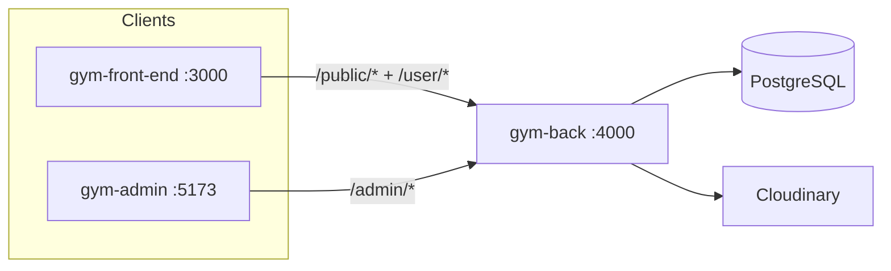
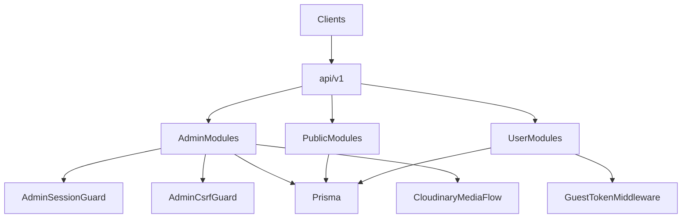

# E-commerce / catalog API (gym-back)

Backend for a **real catalog and storefront**: separate **admin**, **public**, and **user** APIs with different trust models, cookie-based sessions, CSRF on mutating admin requests, guest-aware cart/wishlist, and a modular product domain (variants, attributes, taxes, shipping, media, gallery, orders, inventory, returns).

Part of the gym e-commerce platform alongside [gym-front-end](../gym-front-end) (customer storefront) and [gym-admin](../gym-admin) (admin dashboard).

This is intentionally more than a thin CRUD layer: validation, rate limiting, security headers, structured errors, and a split data model (see `prisma/schema/`).

---

## Platform overview


```mermaid
flowchart LR
  subgraph clients [Clients]
    Storefront[gym-front-end :3000]
    Admin[gym-admin :5173]
  end
  Backend[gym-back :4000]
  DB[(PostgreSQL)]
  Cloudinary[Cloudinary]
  Storefront -->|"/public/* + /user/*"| Backend
  Admin -->|"/admin/*"| Backend
  Backend --> DB
  Backend --> Cloudinary
```

**Recommended startup order:** PostgreSQL → backend (`pnpm run start:dev`) → storefront and admin frontends.

| Service | Default URL |
|---------|-------------|
| Backend API | `http://localhost:4000/api/v1` |
| Storefront | `http://localhost:3000` |
| Admin dashboard | `http://localhost:5173` |

Set `ALLOWED_ORIGINS=http://localhost:3000,http://localhost:5173` so both clients can send credentialed requests.

---

## Why this isn’t “just a simple e-commerce site”

| Area | What the backend actually does |
|------|--------------------------------|
| **Boundaries** | Admin, public, and user modules with different trust models (`src/api/admin/*`, `src/api/public/*`, `src/api/user/*`). |
| **Admin auth** | JWT access + refresh in **HttpOnly cookies**, not a single bearer token in localStorage. |
| **Customer auth** | Separate JWT flow under `/user/auth` with `CUSTOMER_JWT_*` secrets and HttpOnly cookies. |
| **CSRF** | Double-submit token for unsafe admin methods in production (`XSRF-TOKEN` cookie + `x-xsrf-token` header). |
| **Public identity** | Guest tokens for cart/wishlist via middleware + cookie/header (`GuestTokenMiddleware`). |
| **Hardening** | Helmet, `@nestjs/throttler`, Zod env + request validation, CORS with `credentials: true`. |
| **Catalog depth** | Products, variants, attributes, categories, brands, taxes, shipping, gallery, Cloudinary-backed media—not one generic “Product” table and done. |

---

## Authentication & security (how it works)

### Admin (protected)

1. **Login** (`POST /api/v1/admin/auth/login`) issues:
   - `admin_access_token` — HttpOnly JWT (short-lived)
   - `admin_refresh_token` — HttpOnly JWT (longer-lived)
   - `XSRF-TOKEN` — **readable** cookie used with the header below

2. **`AdminSessionGuard`** (global): non-`@Public()` routes require a valid `admin_access_token` cookie; payload is verified and the admin is loaded from the DB. See [`src/common/guards/admin-session.guard.ts`](src/common/guards/admin-session.guard.ts) and `src/api/admin/auth/admin-session.service.ts`.

3. **`AdminCsrfGuard`** (global): for `POST`/`PUT`/`PATCH`/`DELETE` (not `GET`/`HEAD`/`OPTIONS`), in **non-development** environments, the `XSRF-TOKEN` cookie must match the `x-xsrf-token` header. Auth endpoints like login/register/refresh/logout are excluded. See [`src/common/guards/admin-csrf.guard.ts`](src/common/guards/admin-csrf.guard.ts).

4. **Refresh / logout**: `POST /api/v1/admin/auth/refresh` (uses refresh cookie), `POST /api/v1/admin/auth/logout` clears cookies. Session validation for the current user: `GET /api/v1/admin/auth/me`.

Implementation detail: tokens are signed with `jsonwebtoken`; secrets and expiry come from env (`ADMIN_JWT_*`). Cookie `secure` / `sameSite` follow `NODE_ENV` in `admin-auth.controller.ts`.

Used by [gym-admin](../gym-admin).

### Customer (storefront users)

1. **Register / login** (`POST /api/v1/user/auth/register`, `POST /api/v1/user/auth/login`) issue HttpOnly JWT cookies signed with `CUSTOMER_JWT_*` env vars.

2. **`CustomerAuthGuard`** protects user routes — accepts Bearer header or `customer_access_token` cookie.

3. **Refresh / logout / profile**: `POST /api/v1/user/auth/refresh`, `POST /api/v1/user/auth/logout`, `GET /api/v1/user/auth/me`, profile and password updates.

Used by [gym-front-end](../gym-front-end) account, checkout, and order flows.

### Public (anonymous storefront reads)

- Routes that must stay anonymous are marked **`@Public()`** so the admin session guard skips them ([`src/common/decorators/public.decorator.ts`](src/common/decorators/public.decorator.ts)).
- **Cart & wishlist** get a stable **`guestToken`** (header `x-guest-token` or cookie `guestToken`) via `GuestTokenMiddleware` wired in [`src/api/user/user.module.ts`](src/api/user/user.module.ts).
- Optional **`x-customer-id`** is available for flows where the client identifies a logged-in customer (see [`src/common/decorators/current-customer-id.decorator.ts`](src/common/decorators/current-customer-id.decorator.ts)).

### CORS

Allowed origins and credentials are configured in `src/main.ts`; allowed headers include `x-xsrf-token`, `x-guest-token`, and `x-customer-id` so browsers can send admin CSRF and guest context correctly.

---

## Project organization

```
src/
├── api/
│   ├── admin/          # Back-office: auth, catalog, orders, inventory, marketing, settings
│   ├── public/         # Anonymous storefront reads (products, categories, brands, contact)
│   └── user/           # Customer auth, cart, wishlist, checkout, orders, addresses, returns
├── common/             # Guards, filters, interceptors, decorators, DTO helpers
├── config/             # Zod-validated env, app config service
├── modules/            # Integrations (e.g. Cloudinary)
├── prisma/             # Prisma module & service
└── main.ts             # Helmet, cookies, body limit, global prefix api/v1, CORS, DB ping

prisma/
├── schema/             # Split schema files (product, order, cart, inventory, etc.)
└── migrations/

docs/
└── storefront-api-paths.md   # Detailed storefront query params and paths
```

**Global stack wiring** (`src/app.module.ts`): `ThrottlerGuard`, `AdminSessionGuard`, `AdminCsrfGuard`, `ZodValidationPipe`, `TransformInterceptor`, `GlobalExceptionFilter`.

---

## API surface (all under `api/v1`)

| Prefix | Purpose |
|--------|---------|
| `admin/auth` | Register, login, refresh, logout, me |
| `admin/dashboard` | Stats and overview |
| `admin/products`, `admin/product-variants`, `admin/product-attributes` | Catalog management |
| `admin/categories`, `admin/brands`, `admin/collections` | Taxonomy and merchandising |
| `admin/taxes`, `admin/shipping-methods`, `admin/payment-methods` | Pricing & fulfillment config |
| `admin/media`, `admin/gallery` | Uploads & product gallery |
| `admin/orders`, `admin/inventory`, `admin/customers` | Operations |
| `admin/coupons`, `admin/banners`, `admin/reviews`, `admin/returns` | Marketing & support |
| `admin/site-settings`, `admin/contact-messages` | Store config & inbox |
| `public/products`, `public/categories`, `public/brands`, `public/collections` | Storefront browse |
| `public/banners`, `public/site-settings`, `public/media`, `public/contact` | Content & contact |
| `public/products/:productId/reviews` | Product reviews (read) |
| `user/auth` | Customer register, login, refresh, logout, me, profile |
| `user/cart`, `user/wishlist` | Guest/customer cart & wishlist |
| `user/checkout` | Shipping/payment methods, preview, place-order |
| `user/orders`, `user/addresses`, `user/reviews`, `user/returns` | Post-purchase flows |
| *(root)* `GET /api/v1/health` | Liveness-style check |

See [docs/storefront-api-paths.md](docs/storefront-api-paths.md) for detailed storefront paths and query parameters.

---

## Tech stack

- **NestJS 11**, **Prisma 7**, **PostgreSQL**
- **Zod** + `nestjs-zod` for env and request validation
- **JWT** (`jsonwebtoken`) + **cookies** for admin and customer sessions
- **Helmet**, **cookie-parser**, **@nestjs/throttler**
- **Cloudinary** for media (env-driven folder, default `gym-backend/admin-media`)

---

## Architecture snapshot


```mermaid
flowchart TD
  Client[Clients] --> Api[api/v1]
  Api --> AdminApi[AdminModules]
  Api --> PublicApi[PublicModules]
  Api --> UserApi[UserModules]
  AdminApi --> SessionGuard[AdminSessionGuard]
  AdminApi --> CsrfGuard[AdminCsrfGuard]
  UserApi --> GuestMiddleware[GuestTokenMiddleware]
  AdminApi --> Prisma[Prisma]
  PublicApi --> Prisma
  UserApi --> Prisma
  AdminApi --> Cloudinary[CloudinaryMediaFlow]
```

---

## Environment variables

Copy `.env.example` to `.env` and fill in values validated by `src/config/env.schema.ts`:

| Variable | Purpose |
|----------|---------|
| `NODE_ENV` | `development` \| `production` \| `test` \| `provision` |
| `PORT` | HTTP port (recommended `4000` for local dev) |
| `DATABASE_URL` | PostgreSQL connection URL |
| `ALLOWED_ORIGINS` | Comma-separated CORS origins (e.g. `http://localhost:3000,http://localhost:5173`) |
| `ADMIN_JWT_ACCESS_SECRET` | Min 16 chars — admin access token signing |
| `ADMIN_JWT_REFRESH_SECRET` | Min 16 chars — admin refresh token signing |
| `ADMIN_JWT_ACCESS_EXPIRES` | Default `15m` |
| `ADMIN_JWT_REFRESH_EXPIRES` | Default `7d` |
| `CUSTOMER_JWT_ACCESS_SECRET` | Min 16 chars — customer access token signing |
| `CUSTOMER_JWT_REFRESH_SECRET` | Min 16 chars — customer refresh token signing |
| `CUSTOMER_JWT_ACCESS_EXPIRES` | Default `15m` |
| `CUSTOMER_JWT_REFRESH_EXPIRES` | Default `7d` |
| `CLOUDINARY_CLOUD_NAME` | Media uploads |
| `CLOUDINARY_API_KEY` | Media uploads |
| `CLOUDINARY_API_SECRET` | Media uploads |
| `CLOUDINARY_UPLOAD_FOLDER` | Default `gym-backend/admin-media` |

---

## How to run

```bash
pnpm install
cp .env.example .env   # edit DATABASE_URL, JWT secrets, Cloudinary credentials
pnpm run prisma:generate
pnpm run prisma:migrate   # or prisma:push for quick local iteration
pnpm run prisma:seed      # optional: tax + 10 categories + 20 products with images
pnpm run start:dev
```

- API base URL: `http://localhost:<PORT>/api/v1`
- Health: `GET http://localhost:<PORT>/api/v1/health`

### Seed data

`pnpm run prisma:seed` upserts:

- 1 default tax (**Standard VAT** 15%)
- 10 gym/supplement categories with Unsplash images
- 20 products (2 per category) with thumbnails, gallery image, base variant, and inventory

Safe to re-run (idempotent by slug / media `key`). Seeded image host `images.unsplash.com` is allowlisted in the storefront `next.config.ts`.

### Scripts (from `package.json`)

| Script | Command |
|--------|---------|
| Build | `pnpm run build` |
| Dev | `pnpm run start:dev` |
| Prod | `pnpm run start:prod` |
| Prisma | `pnpm run prisma:generate`, `prisma:migrate`, `prisma:studio`, `prisma:seed` |
| Lint / format | `pnpm run lint`, `pnpm run format` |
| Tests | `pnpm run test`, `pnpm run test:e2e`, `pnpm run test:cov` |

---

## Testing note

E2E and unit test coverage is minimal today; improving tests is a natural next step for production hardening. The **design** above (auth, CSRF, guest cart, module split) is what this repo demonstrates for backend depth.

---

## License

See repository / `package.json` (`UNLICENSED` if not specified otherwise).
